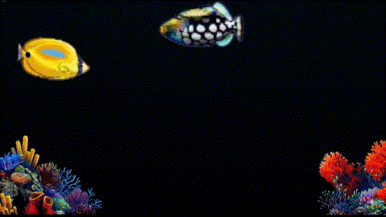

# AquariumSaver



> **Disclaimer:** This project was vibe-coded. ~80% of the code was generated by **Qwen 3.6-27B-Q8_0-MTP** running locally on a **Strix Halo AI MAX 128 GB**. Claude Opus was used for a few stubborn bugs and to solution making sprites for the assets. All art and sprites were generated by **Nano Banana 2** — nothing here was hand-drawn. This project is part of my journey learning techniques to vibe code effectively -- especially using local AI with my own hardware.

*Idea:* I used to love the old Windows 98 Underwater screen saver so I recreated it for my work laptop.

A Windows screensaver (`.scr`) rendering an animated underwater aquarium with sprite-based fish, rising bubbles, and corner reefs. Renders independently on every monitor at mixed resolutions and DPI, with smooth 30–120 Hz animation.

## Features

- **7 fish species** — yellow butterflyfish, stingray, blue triggerfish, blue tang, moorish idol, orange butterflyfish, clown triggerfish — each with 30–40 cel-style animation frames at 30 FPS
- **Double-buffered rendering** — front/back buffer swap ensures a failed draw is never presented; the last good frame stays visible
- **Static background caching** — water gradient and reef corners are rendered once per client size and reused every frame
- **Depth-sorted rendering** — fish at different depths with parallax-like speed and opacity variation
- **Variable swim angles** — each fish follows a unique diagonal path with configurable angles up to ±45°
- **Configurable bubble emitters** — up to 6 emitters with per-emitter position, speed, and size range; bubbles sway, grow, and fade as they rise
- **Multi-monitor support** — each monitor shows a viewport into one shared virtual-desktop aquarium; all monitors display the same moment in time
- **Auto refresh-rate detection** — detects display refresh rate per-monitor via `EnumDisplaySettings`, with user-overridable `TargetFps` setting (Auto / 30 / 50 / 60 / 100 / 120)
- **Fixed-timestep simulation** — simulation time is derived from a single process-wide `Stopwatch`; rendering uses interpolated positions
- **Graceful error handling** — render failures are logged and the last good frame persists; after 300 consecutive failures rendering is suspended. All exceptions are caught and logged to `%LOCALAPPDATA%\AquariumSaver\AquariumSaver.log`
- **Exit on input** — mouse movement > 80 px or any key press quits the screensaver (3-second startup grace period to ignore cursor settling)
- **Settings dialog** — per-species speed and scale, bubble emitter configuration, swim angle, background colors, target FPS, with live preview panel
- **Self-contained publish** — single-file `.scr` with no .NET runtime dependency

## Project structure

```
AquariumSaver/
├── AquariumSaver.csproj          # .NET 8 WinForms, net8.0-windows
├── Program.cs                    # Entry point: /s run, /p preview, /c configure, --windowed debug
├── Scene.cs                      # SpriteAtlas (PNG loader + manifest), SharedAquarium (simulation + rendering), Scene (viewport)
├── Screensaver.cs                # ScreensaverForm (full-screen), PreviewForm (control panel), ConfigForm (settings), ExitWatcher, AppLog
├── Settings.cs                   # SettingsData (POCO), BubbleEmitterConfig, SpeciesConfig, Settings (registry read/write)
├── Native.cs                     # Win32 P/Invoke: SetParent, IsWindow, GetClientRect, Get/SetWindowLongPtr
├── build.ps1                     # Windows build script
├── build.sh                      # Linux cross-compile script
├── AquariumSpriteGenerator/      # Sprite generation tool (separate project, excluded from main build)
│   ├── AquariumSpriteGenerator.csproj
│   ├── SpriteGenerator.cs
│   └── sprites.png               # source sprite sheet
├── CaptureGif/                   # GIF capture utility (separate project)
├── Sprites/                      # Generated PNG assets
│   ├── manifest.json             # Species metadata, frame counts, speeds, scales
│   ├── Fish/                     # 7 species × 30–40 frames each + preview.png
│   ├── Bubbles/                  # 5 bubble sprite sizes (12–52 px)
│   └── Reef/                     # reef-left.png, reef-right.png
└── Prompt/                       # Original phase prompt files (dev history)
```

## Rendering pipeline (per frame)

1. **Timer Tick** (UI thread) — computes elapsed time, calls `Scene.Update(delta)`
2. **`SharedAquarium.Advance()`** — reads absolute time from the process-wide `Stopwatch`
3. **`Scene.Draw()`** — renders into the hidden back buffer:
   - Opaque black safety clear via `SourceCopy` compositing
   - Cached static background (water gradient + corner reefs)
   - Fish (depth-sorted, virtual-desktop coordinates)
   - Bubbles (per-screen, client-local coordinates)
4. **Buffer swap** — `_frontIsA` toggled only after the complete frame succeeds
5. **`Invalidate()`** — posts `WM_PAINT`
6. **`OnPaint`** (UI thread) — blits the completed front buffer to screen via `SourceCopy`

All steps run on the UI thread — no concurrent access to the back buffer, no tearing, no black flashes. A failed draw never reaches the screen.

## Multi-monitor design

All full-screen `ScreensaverForm` instances share one `SharedAquarium`. Each form holds a `Scene` that maps virtual-desktop coordinates to its own monitor's client area. Fish use virtual-desktop coordinates (shared across monitors); bubbles use per-screen client-local coordinates.

## Building

### Windows (PowerShell)

```powershell
.\build.ps1
```

Produces `publish/AquariumSaver.scr` — a self-contained single-file executable.

### Linux (cross-compile)

```bash
./build.sh
```

Requires the .NET 8 SDK with Windows targeting packs installed.

### Manual

```bash
dotnet publish AquariumSaver.csproj -c Release -r win-x64 --self-contained true \
  -p:PublishSingleFile=true -p:IncludeNativeLibrariesForSelfExtract=true \
  -p:PublishReadyToRun=true -o publish
```

Rename `publish/AquariumSaver.exe` → `publish/AquariumSaver.scr`.

## Usage

```
AquariumSaver.scr /s           # Full-screen on all monitors
AquariumSaver.scr /p:<hwnd>    # Preview inside control panel
AquariumSaver.scr /c           # Settings dialog
AquariumSaver.scr --windowed   # Debug window (resizable, no exit watcher)
```

Register as a system screensaver by copying `AquariumSaver.scr` to `%WINDIR%\System32\` or selecting it in Windows Settings → Personalization → Lock screen → Screen saver.

## Settings

Stored in `HKCU\Software\AquariumSaver`:

### Global

| Setting               | Default       | Range / Values            |
|-----------------------|---------------|---------------------------|
| `SwimAngle`           | 15°           | 0–45                      |
| `TargetFps`           | 0 (Auto)      | 0, 30, 50, 60, 100, 120   |

### Per-species fish config

| Setting | Default | Range   |
|---------|---------|---------|
| `Speed` | species-specific | 0.005–0.10 |
| `Scale` | species-specific | 0.3–3.0 |

### Per-bubble-emitter config (1–6 emitters)

| Setting   | Default | Range   |
|-----------|---------|---------|
| `X`       | 50      | 0–100 (% of screen width) |
| `Y`       | 10      | 0–100 (% of screen height) |
| `Speed`   | 1.0     | 0.1–3.0 |
| `SizeMin` | 15      | 5–80 (px at 1080p) |
| `SizeMax` | 30      | 5–80 (px at 1080p) |
| `Enabled` | true    | bool    |

## Error logging

All exceptions and render failures are logged to `%LOCALAPPDATA%\AquariumSaver\AquariumSaver.log`. Screensavers must fail silently — no UI dialogs are shown on error.

## License

Apache 2.0. See [LICENSE](LICENSE).
